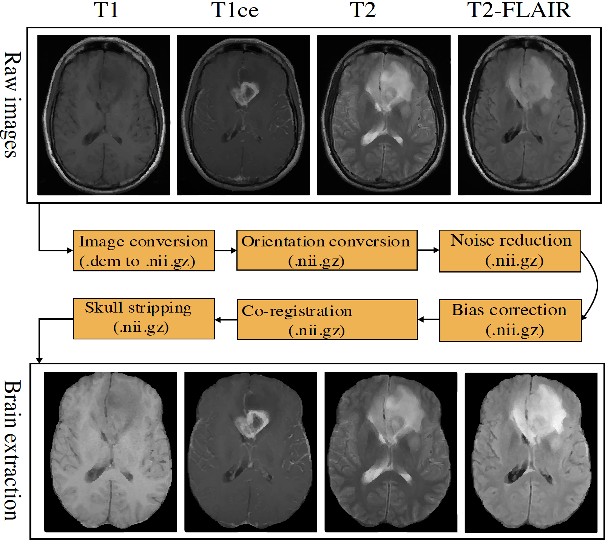

# A General Skull Stripping of Multiparametric Brain MRIs Using 3D Convolutional Neural Network

The objective of the project is to strip skull for multiparametric MRIs (mpMRIs). Users can find the pre-trained model in folder: pre-trained-model. The proposed method is convolutional neural network (CNN)-based. The algorithim is implemented in Python. It works for healthy brain mpMRIs, pre-operative mpMRIs, and post-operative mpMRIs. Furthermore, the algorithm is easy to custermize for any image modality (or any combinations). The proposed architecture is showing as:


There are skull stripping cases for healthy, pre-operative, and post-operative mpMRIs.


Required packages:
1. PyTorch (suggest version: 1.10.0)
2. configparser
3. SimpleITK
4. Numpy 
5. Scipy
-----
## Data structure
```tree
last_train
    RRC_0001_fusion.nii.gz
    RRC_0002_fusion.nii.gz
    ...


last_test
    RRC_0003
        RRC_0003_flair.nii.gz
        RRC_0003_t1.nii.gz
        RRC_0003_t1ce.nii.gz
        RRC_0003_t2.nii.gz
    RRC_0004
        RRC_0004_flair.nii.gz
        RRC_0004_t1.nii.gz
        RRC_0004_t1ce.nii.gz
        RRC_0004_t2.nii.gz
    ...

```
## Usage
The configuration must be properly set up. Here are important configures:
* root_dir: parent directory for images
* model_path: directory to save the trained model
* num_ndf: initial number of channels
* s_modality: image modalities, such as f1c2 (where f: FLAIR, 1: T1, c:T1ce, 2: T2)
* num_class: 1 (for binary classification)
* num_epoch: number of epoches
* lr: initial learning rate
* transforms: data augmentation, such as random crop, etc.
* train_list: a text file contains the training sample file names
* valid_list: a text file contains the training sample file names
* img_dir: directory to training/validation data
### Train model (strongly recommend GPU)
To train your own model, the mpMRIs must be pre-processed following the pipeline. The mpMRIs needs to be normalized and stacked with sequence of FLAIR, T1, T1ce, and T2.

Once the mpMRIs is preprocessed, execute the following code to train your own model.
>python train.py
### Inference 
Once you have a trained model (or use the pre-trained model), it is very easy to apply the model to your test images. Note that it requires all four image modalities to use the pre-trained model. You only set the right directory to the test data in config.ini file. The test_online.py automatically normalize the mpMRIs. To get the skull stripping, execute the following code:
>python test_online.py

### State-of-the-art comparison
We also compare the proposed method to popular methods/tools (including traditional methods and recent deep learning-based methods). Here is the comparison.


### Citation
Pei, L., Murat, A.K., Tahon, N.H.M. et al. A general skull stripping of multiparametric brain MRIs using 3D convolutional neural network. Sci Rep 12, 10826 (2022). 
[https://doi.org/10.1038/s41598-022-14983-4](https://doi.org/10.1038/s41598-022-14983-4)

